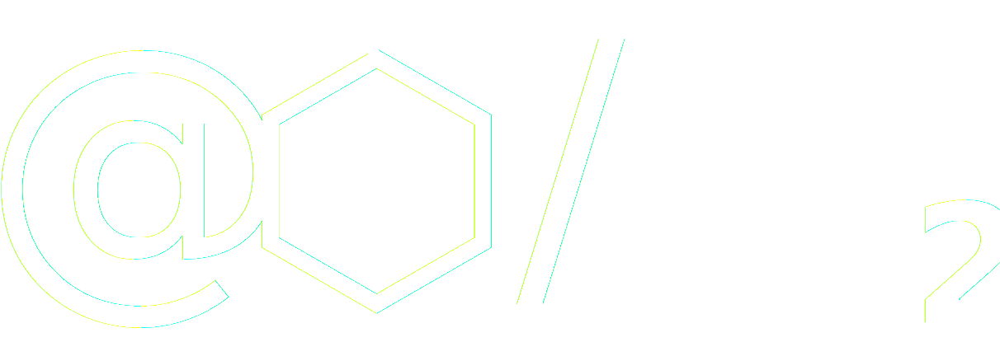

[![LinkedIn][linkedin-shield]][linkedin-url]

<br />
<p align="center" style="background: #42b983;">
  <a href="http://vue.carbondesignsystem.com/"></a>
</p>
<h3 align="center">CloudAppi ::: Code Challenge</h3>
<p align="center"><a href="https://3c878876.ngrok.io">Ver demo</a></p>

## Acerca del desafío

[![Product Name Screen Shot][product-screenshot]](https://example.com)

Una implementación FrontEnd simple, un BackEnd simulado. Tecnologías en cooperación, Vue y Carbon Design System desde el cliente, swagger y nodejs desde el servidor.
Pruebas, internacionalización, herramientas de código, versionaminento y muchas otros complementos.

### Construido con

- [Vue](https://vuejs.org/)
- [Carbon Design System](https://www.carbondesignsystem.com/)
- [i18n](https://www.i18next.com/)
- [Swagger](https://swagger.io/)
- [Jest](https://jestjs.io/)

## Empezando

Antes de obtener una copia local y disfrutar de la implementación, habilite su entorno instalando [Node](https://nodejs.org/en/).

### Installation

1. Clone el repositorio

```sh
git clone https://github.com/deoxyshub/cloudappi-code-challenge.git
```

2. Instale los paquetes NPM

```sh
npm install -g @vue/cli
npm install
```

[linkedin-shield]: https://img.shields.io/badge/-LinkedIn-black.svg?style=flat-square&logo=linkedin&colorB=555
[linkedin-url]: https://linkedin.com/in/jhmorales
[product-screenshot]: src/assets/screenshot.png
